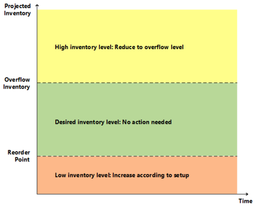

# Hönnunarupplýsingar: undir yfirflæðisstigiDesign Details: Staying under the Overflow Level
Þegar reglur um hámarksmagn og fast endurpöntunarmagn eru notaðar einblínir áætlanakerfið aðeins á ætlaðar birgðir í tilgreindum tímaramma.When using the Maximum Qty. and Fixed Reorder Qty. policies, the planning system focuses on the projected inventory in the given time-bucket only. Þetta þýðir að áætlanakerfið geta stinga upp á óþarfa framboð þegar neikvæð eftirspurn eða jákvæðar breytingar á framboð koma fram utan ákveðins tímaramma.This means that the planning system may suggest superfluous supply when negative demand or positive supply changes occur outside of the given time bucket. Ef, af þessum sökum, umframframboð er stungið upp á, reiknar áætlanagerðarkerfið hvaða magn framboðið skal minnka í (eða eytt) til að forðast umframframboð.If, for this reason, a superfluous supply is suggested, the planning system calculates which quantity the supply should be decreased to (or deleted) to avoid the superfluous supply. Þetta magn er kallað „yfirflæðisstig“.This quantity is called the “overflow level.” Yfirflæðið er miðlað sem áætlanalína með **Breyta magni (Lækkun)** eða **Hætta við** aðgerð og eftirfarandi viðvörun skilaboð:The overflow is communicated as a planning line with a **Change Qty. (Decrease)** or **Cancel** action and the following warning message:  

*Athugið: Áætlaðar birgðir [xx] er hærra en yfirflæðisstig [xx] á gjalddaga [xx].**Attention: The projected inventory [xx] is higher than the overflow level [xx] on the Due Date [xx].*  

  

##  Reiknar yfirflæðisstigCalculating the Overflow Level  
Yfirflæðisstigið er reiknað út á mismunandi hátt, allt eftir uppsetningu áætlana.The overflow level is calculated in different ways depending on planning setup.  

### Endurpöntunarstefna fyrir HámarksmagnMaximum Qty. reordering policy  
Yfirflæðisstig = HámarksbirgðirOverflow level = Maximum Inventory  

> [!NOTE]  
>  Ef lágmarkspöntunarmagn er til, þá verður því bætt við eins og hér segir: Yfirflæðisstig = Hámarksbirgðir + lágmarkspöntunarmagn.If a minimum order quantity exists, then it will be added as follows: Overflow level = Maximum Inventory + Minimum Order Quantity.  

### Endurpöntunarstefna fasts endurpöntunarmagnFixed Reorder Qty. reordering policy  
Yfirflæðisstig = Endurpöntunarmagn + EndurpöntunarmarkOverflow level = Reorder Quantity + Reorder Point  

> [!NOTE]  
>  Ef lágmarkspöntunarmagn er yfir endurpöntunarmarkinu er því skipt út eins og hér segir: Yfirflæðisstig = Endurpöntunarmagn + lágmarkspöntunarmagnIf the minimum order quantity is higher than the reorder point, then it will replace as follows: Overflow Level = Reorder Quantity + Minimum Order Quantity  

### Margföld pöntunOrder Multiple  
Ef margföld pöntun er til mun hún leiðrétta yfirflæðisstigið fyrir endurpöntunarstefnurnar fyrir bæði hámarksmagn og fast endurpöntunarmagn.If an order multiple exists, then it will adjust the overflow level for both Maximum Qty. and Fixed Reorder Qty. reordering policies.  

##  Stofna áætlunarlínu með yfirfallsviðvörunCreating the Planning Line with Overflow Warning  
Þegar núverandi framboð veldur því að áætlaðar birgðir eru meiri en yfirflæðisstigið við lok tímaramma er búin til áætlunarlína.When an existing supply causes the projected inventory to be higher than the overflow level at the end of a time bucket, a planning line is created. Til að vara við hugsanlega óþarft framboð, er áætlunarlínan með viðvörunarboð, **Samþykkja aðgerðaboð** reiturinn er ekki valinn, og aðgerðaboð eru annaðhvort Hætta við eða Breyta Magni.To warn about the potential superfluous supply, the planning line has a warning message, the **Accept Action Message** field is not selected, and the action message is either Cancel or Change Qty.  

### Reiknar magn áætlunarlínuCalculating the Planning Line Quantity  
Magn áætlunarlínu = Núverandi framboðsmagn – (Áætlaðar birgðir – Yfirflæðisstig)Planning Line Quantity = Current Supply Quantity – (Projected Inventory – Overflow Level)  

> [!NOTE]  
>  Eins og í öllum viðvörunarlínum verður hámarks-/lágmarkspöntunarmagn eða endurtekin pöntun hundsuð.As with all warning lines, any maximum/minimum order quantity or order multiple will be ignored.  

### Skilgreina tegund aðgerðaboðaDefining the Action Message Type  

-   Ef magn áætlunarlínu er meira en 0 eru aðgerðaboðin Breyta magni.If the planning line quantity is higher than 0, then the action message is Change Qty.  
-   Ef magn áætlunarlínu er jafnt og eða minna en 0 eru aðgerðaboðin Hætta við.If the planning line quantity is equal to or lower than 0, then the action message is Cancel  

### Semja viðvörunarmerkiðComposing the Warning Message  
Í tilviki yfirflæðis birtir glugginn **Óraktar áætlunareiningar** viðvörun skilaboð með eftirfarandi upplýsingum:In case of overflow, the **Untracked Planning Elements** window displays a warning message with the following information:  

-   Áætlað birgðastig sem setti af stað viðvörunina.The projected inventory level that triggered the warning  
-   Reiknaða yfirflæðisstigiðThe calculated overflow level  
-   Lokadagur framboðstilviks.The due date of the supply event.  

Dæmi Áætlaðar birgðir 120 eru meiri en yfirflæðisstigið 60 á 28-01-11Example: “The projected inventory 120 is higher than the overflow level 60 on 28-01-11”  

## AðstæðurScenario  
Í þessari atburðarás, breytir viðskiptamaður sölupöntun frá 70 í 40 stykki milli tveggja áætlunarkeyrslna.In this scenario, a customer changes a sales order from 70 to 40 pieces between two planning runs. Yfirflæðisbúnaðurinn grípur inn í til að draga úr innkaupunum sem lögð voru til fyrir upphaflega sölumagnið.The overflow feature sets in to reduce the purchase that was suggested for the initial sales quantity.  

### VöruuppsetningItem setup  

|EndurpöntunarstefnaReordering Policy|HámarksmagnMaximum Qty.|  
|-----------------------|------------------|  
|Hámarksmagn pöntunarMaximum Order Quantity|100%100|  
|EndurpöntunarmarkReorder Point|5050|  
|BirgðirInventory|8080|  

### Staða fyrir söluminnkunSituation before sales decrease  

|AtburðurEvent|Breyta magniChange Qty.|Áætlaðar birgðirProjected Inventory|  
|-----------|-----------------|-------------------------|  
|Dagur eittDay one|EkkertNone|8080|  
|SalaSale|-70-70|1010|  
|Lok tímarammaEnd of time bucket|EkkertNone|1010|  
|Leggja til nýja innkaupapöntunSuggest new purchase order|+90+90|100%100|  

### Staða eftir söluminnkunSituation after sales decrease  

|BreytingChange|Breyta magniChange Qty.|Áætlaðar birgðirProjected Inventory|  
|------------|-----------------|-------------------------|  
|Dagur eittDay one|EkkertNone|8080|  
|SalaSale|-40-40|4040|  
|InnkaupPurchase|+90+90|130130|  
|Lok tímarammaEnd of time bucket|EkkertNone|130130|  
|Stinga upp á að minnka innkaupSuggest to decrease purchase   panta frá 90 til 60order from 90 to 60|-30-30|100%100|  

### ÁætlunarlínurResulting Planning Lines  
 Ein áætlunarlína (viðvörun) er stofnuð til að draga úr innkaupum um 30 úr 90 í 60 til að halda áætluðum birgðum í 100 samkvæmt yfirflæðisstiginu.One planning line (warning) is created to reduce the purchase with 30 from 90 to 60 to keep the projected inventory on 100 according to the overflow level.  

  

> [!NOTE]  
>  Ef búnaðurinn Yfirfall er ekki til staðar er ekki stofnuð nein viðvörun ef áætlaðar birgðir eru meiri en hámarksbirgðir.Without the Overflow feature, no warning is created if the projected inventory level is above maximum inventory. Þetta kann að valda óþörfu framboði upp á 30.This could cause a superfluous supply of 30.  

## Sjá einnigSee Also  
[Hönnunarupplýsingar: Endurpöntunarstefnur](design-details-reordering-policies.md) [Design Details: Reordering Policies](design-details-reordering-policies.md)   
[Hönnunarupplýsingar: Áætlunarfæribreytur](design-details-planning-parameters.md) [Design Details: Planning Parameters](design-details-planning-parameters.md)   
[Hönnunarupplýsingar: Meðhöndlun endurpöntunarstefna](design-details-handling-reordering-policies.md) [Design Details: Handling Reordering Policies](design-details-handling-reordering-policies.md)   
[Hönnunarupplýsingar: framboðsáætlunDesign Details: Supply Planning](design-details-supply-planning.md)

